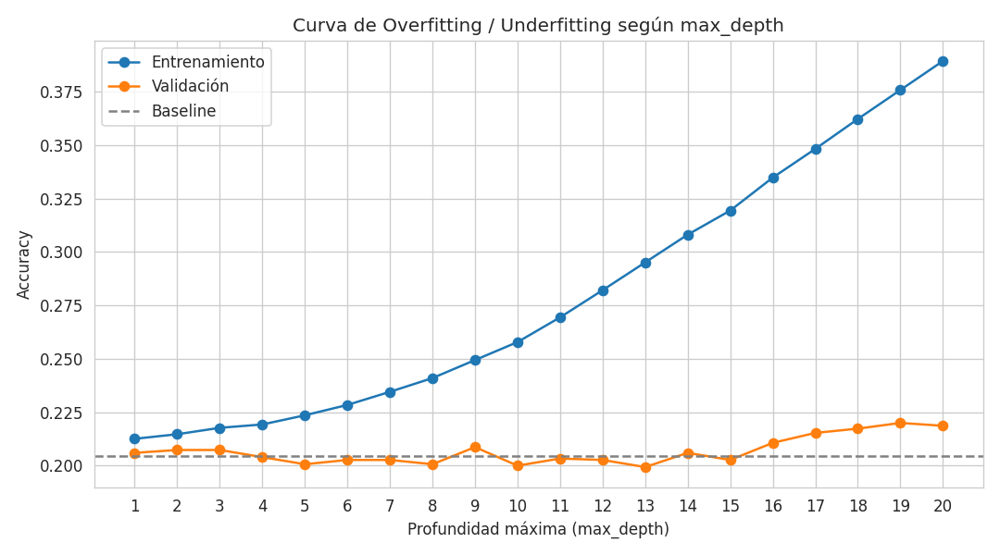
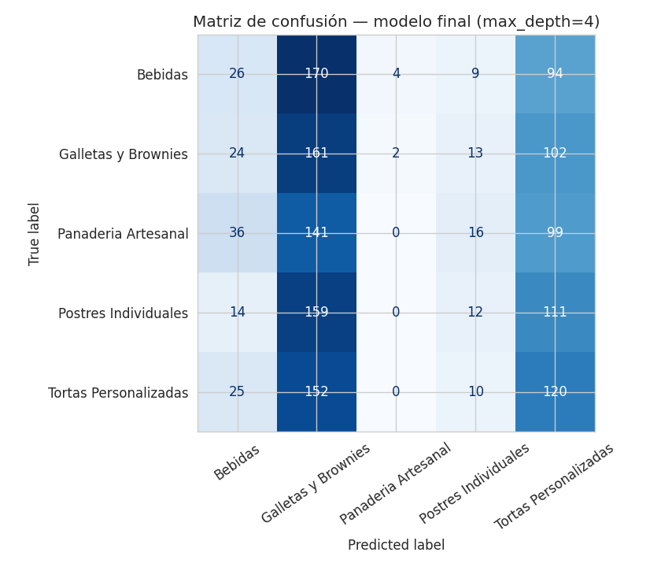
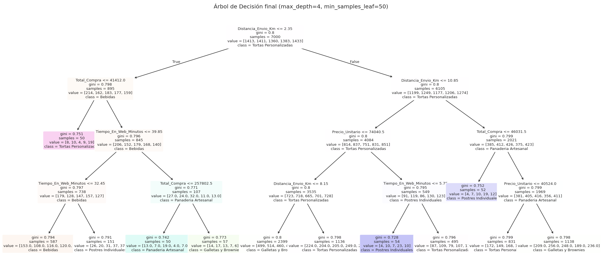
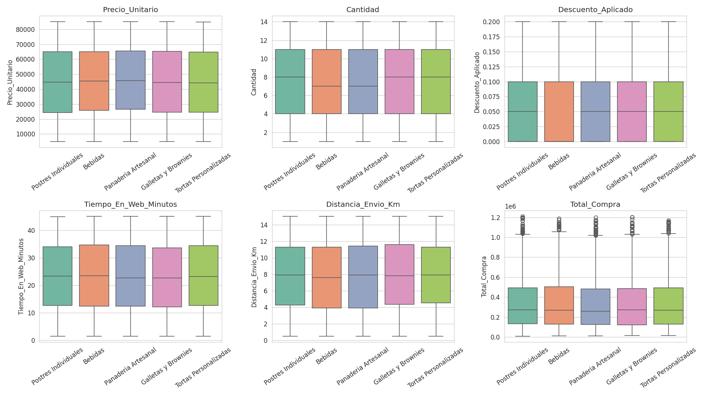

# 🌳 Clasificación de Categoría de Producto en E-commerce de Repostería con Árbol de Decisión

[](https://www.python.org/)
[](https://scikit-learn.org/stable/modules/tree.html)
[](https://jupyter.org/)
[](#licencia)
[](https://colab.research.google.com/github/jeffer301/INTELIGENCIA-ARTIFICIAL--JEFFERSON-VALENCIA/blob/main/Proyecto%20Final%20Inteligencia%20Artificial/notebook/proyecto_final_ml.ipynb)

Proyecto final de la asignatura **Inteligencia Artificial** — Programa de Ingeniería de Sistemas,
Semestre 8, **Universidad del Pacífico**. Implementa, entrena y evalúa un **Árbol de Decisión**
(`scikit-learn`) para clasificar la categoría de producto de una transacción de e-commerce,
siguiendo el flujo completo de un proyecto de Machine Learning y prestando especial atención a la
detección y corrección de **overfitting** y **underfitting**.

> 📓 El desarrollo completo, con código, gráficas y explicaciones paso a paso, está en
> [`notebook/proyecto_final_ml.ipynb`](notebook/proyecto_final_ml.ipynb).

---

## 📑 Tabla de contenido

1. [Descripción del problema](#-descripción-del-problema)
2. [Dataset](#-dataset)
3. [¿Qué es un Árbol de Decisión?](#-qué-es-un-árbol-de-decisión)
4. [Estructura del repositorio](#-estructura-del-repositorio)
5. [Cómo ejecutar el proyecto](#-cómo-ejecutar-el-proyecto)
6. [Metodología](#-metodología)
7. [Overfitting vs. Underfitting: el hallazgo central](#-overfitting-vs-underfitting-el-hallazgo-central)
8. [Resultados](#-resultados)
9. [Cuándo usar (y cuándo no) un Árbol de Decisión](#-cuándo-usar-y-cuándo-no-un-árbol-de-decisión)
10. [Limitaciones](#-limitaciones)
11. [Conclusiones](#-conclusiones)
12. [Referencias](#-referencias)

---

## 🎯 Descripción del problema

Un e-commerce de repostería necesita predecir a cuál de **5 categorías** pertenece un producto
comprado, a partir únicamente de datos numéricos de la transacción (precio, cantidad, descuento,
tiempo en el sitio, envío, total pagado). Es un problema de **clasificación multiclase**:

- 🥤 Bebidas
- 🍪 Galletas y Brownies
- 🥖 Panadería Artesanal
- 🍮 Postres Individuales
- 🎂 Tortas Personalizadas

**Objetivo general:** implementar y evaluar un Árbol de Decisión siguiendo el ciclo completo de un
proyecto de ML — preparación de datos, entrenamiento, validación, evaluación con métricas
apropiadas y análisis crítico de los resultados (incluyendo un diagnóstico explícito de
sobreajuste/subajuste).

## 📊 Dataset

`data/ecommerce_reposteria_10000.csv` — **10.000 transacciones**, 9 columnas, sin valores nulos ni
duplicados, con las 5 categorías balanceadas (~20% cada una).

| Columna | Descripción |
|---|---|
| `ID_Transaccion` | Identificador único (no predictivo) |
| `Categoria_Producto` | **Variable objetivo** (5 clases) |
| `Precio_Unitario` | Precio por unidad |
| `Cantidad` | Unidades compradas |
| `Descuento_Aplicado` | % de descuento (0–1) |
| `Tiempo_En_Web_Minutos` | Minutos de navegación antes de comprar |
| `Distancia_Envio_Km` | Distancia de envío |
| `Costo_Envio` | Costo del envío (correlación perfecta con la distancia → se descarta) |
| `Total_Compra` | Valor total de la transacción |

## 🌳 ¿Qué es un Árbol de Decisión?

Un Árbol de Decisión aprende reglas *"si-entonces"* dividiendo los datos en nodos, eligiendo en
cada división la variable y el punto de corte que **más reduce la impureza** (medida con el
**índice de Gini** o la **entropía**), hasta llegar a hojas que representan la predicción final.
Es interpretable, no requiere escalar variables y captura relaciones no lineales — pero es propenso
al overfitting si se deja crecer sin control. Ver el detalle matemático completo, ventajas,
limitaciones y comparación con otros modelos en el
[notebook, sección 3](notebook/proyecto_final_ml.ipynb).

Documentación oficial: [scikit-learn — Decision Trees](https://scikit-learn.org/stable/modules/tree.html)

## 📁 Estructura del repositorio

```
.
├── README.md                          <- Este archivo
├── notebook/
│   └── proyecto_final_ml.ipynb        <- Notebook completo (19 puntos de la rúbrica)
├── data/
│   └── ecommerce_reposteria_10000.csv <- Dataset usado
├── assets/                            <- Gráficas exportadas para este README
│   ├── eda_boxplots.png
│   ├── overfitting_curve.png
│   ├── confusion_matrix.png
│   └── decision_tree.png
└── requirements.txt                   <- Dependencias de Python
```

## ▶️ Cómo ejecutar el proyecto

```bash
# 1. Clonar el repositorio
git clone https://github.com/jeffer301/INTELIGENCIA-ARTIFICIAL--JEFFERSON-VALENCIA.git
cd "INTELIGENCIA-ARTIFICIAL--JEFFERSON-VALENCIA/Proyecto Final Inteligencia Artificial"

# 2. Crear un entorno virtual (opcional pero recomendado)
python3 -m venv venv
source venv/bin/activate        # En Windows: venv\Scripts\activate

# 3. Instalar dependencias
pip install -r requirements.txt

# 4. Abrir el notebook
jupyter notebook notebook/proyecto_final_ml.ipynb
```

`requirements.txt`:
```
pandas
numpy
scikit-learn
matplotlib
seaborn
```

## 🔬 Metodología

| Paso | Descripción |
|---|---|
| 1. EDA | Revisión de nulos, duplicados, distribución de clases, boxplots por categoría y matriz de correlación |
| 2. Limpieza | Dataset ya limpio; se documenta el proceso de verificación |
| 3. Selección de variables | Se elimina `ID_Transaccion` (identificador) y `Costo_Envio` (redundante, correlación 1.0 con `Distancia_Envio_Km`) |
| 4. Partición | **Entrenamiento 70% / Validación 15% / Prueba 15%**, estratificada por clase |
| 5. Baseline | `DummyClassifier` (clase más frecuente) ≈ 20.5% accuracy — punto de referencia obligatorio |
| 6. Entrenamiento | Árbol de decisión sin restricciones (caso base) |
| 7. Ajuste de hiperparámetros | `GridSearchCV` + `StratifiedKFold` (5 folds) sobre `max_depth`, `min_samples_leaf`, `criterion` |
| 8. Selección final | Comparación manual de 3 árboles (libre / elegido por grid search / simple) → se elige el más generalizable |
| 9. Evaluación | Accuracy, Precision, Recall, F1 (macro), matriz de confusión, curva ROC/AUC (One-vs-Rest) |
| 10. Interpretación | Importancia de variables, visualización del árbol, análisis de overfitting/underfitting |

## ⚖️ Overfitting vs. Underfitting: el hallazgo central

Este fue el resultado más importante del proyecto — se buscó deliberadamente **no caer ni en
sobreajuste ni en subajuste**:



| Modelo | Accuracy Entrenamiento | Accuracy Validación | Accuracy Prueba |
|---|---|---|---|
| Árbol libre (sin límites) | **1.000** ⚠️ overfitting extremo | 0.201 | 0.199 |
| Árbol elegido por `GridSearchCV` | 0.453 ⚠️ overfitting residual | 0.205 | 0.201 |
| **Árbol simple (`max_depth=4`, `min_samples_leaf=50`) — modelo final** | **0.228** ✅ | **0.203** ✅ | **0.213** ✅ |
| Baseline (clase más frecuente) | — | — | 0.205 |

- El **árbol sin restricciones** memoriza el 100% de los datos de entrenamiento (58 niveles de
  profundidad, 3.667 hojas) pero no generaliza: accuracy en validación cae al nivel del azar.
  Es el ejemplo de libro de **overfitting**.
- `GridSearchCV`, al buscar hiperparámetros sobre una señal predictiva débil, terminó eligiendo una
  configuración que **todavía mostraba una brecha considerable** entre entrenamiento y validación —
  una lección importante: la validación cruzada automática no siempre garantiza el mejor modelo
  cuando la relación entre variables y objetivo es débil.
- El **árbol simple**, restringido manualmente, es el que mejor equilibra sesgo y varianza: sus tres
  accuracy son casi idénticos entre sí. Por eso se seleccionó como **modelo final recomendado**,
  priorizando la capacidad de generalizar sobre una ganancia marginal e inestable de accuracy.

## 📈 Resultados

**Métricas del modelo final (`max_depth=4`, `min_samples_leaf=50`) en el conjunto de prueba:**

| Métrica | Valor |
|---|---|
| Accuracy | 0.213 |
| Precision (macro) | 0.168 |
| Recall (macro) | 0.210 |
| F1-Score (macro) | 0.155 |
| AUC promedio (One-vs-Rest) | ~0.50 |





**Análisis exploratorio — las variables numéricas apenas varían entre categorías** (una de las
causas del desempeño modesto):



> Un AUC cercano a 0.50 y un accuracy cercano al baseline (~20%) indican que el modelo discrimina
> apenas un poco mejor que el azar. **No es un error del proceso**: es la conclusión honesta de que
> las variables disponibles (precio, cantidad, descuento, tiempo en la web, envío) no contienen
> suficiente información para predecir la categoría del producto, algo que ya se anticipaba en el
> análisis exploratorio.

## ✅ Cuándo usar (y cuándo no) un Árbol de Decisión

**Úsalo cuando:** necesitas un modelo interpretable y explicable, tus datos tienen relaciones no
lineales, no quieres invertir tiempo en escalar variables, o buscas un *baseline* rápido antes de
probar modelos de conjunto (Random Forest, Gradient Boosting).

**Evítalo (o úsalo con cuidado) cuando:** el dataset es pequeño y ruidoso (se sobreajusta
fácilmente), necesitas la máxima precisión posible (un ensamble de árboles casi siempre gana), o
—como en este proyecto— las variables predictoras simplemente no tienen relación real con el
objetivo: ningún algoritmo puede aprender un patrón que no existe en los datos.

## ⚠️ Limitaciones

- Alta varianza e inestabilidad ante pequeños cambios en los datos.
- Fronteras de decisión "escalonadas" (poco realistas frente a relaciones suaves entre variables).
- En este proyecto en particular: las variables disponibles no mostraron relación fuerte con la
  categoría del producto, lo que limita el techo de desempeño alcanzable por cualquier modelo, no
  solo por el árbol de decisión. Variables más directamente ligadas al producto (peso, ingredientes,
  temporada, descripción) probablemente tendrían mayor poder predictivo.

## 🏁 Conclusiones

- El dataset (10.000 filas, limpio y balanceado) es **suficiente en cantidad** para entrenar un
  Árbol de Decisión de forma estable, pero sus variables tienen **poca relación real** con la
  categoría del producto, lo que limita el desempeño predictivo alcanzable.
- Se demostró de forma práctica y visual cómo identificar el **overfitting** (árbol libre: 100% vs
  20% de accuracy) y cómo mitigarlo controlando la complejidad del modelo (`max_depth`,
  `min_samples_leaf`), sin caer tampoco en **underfitting** (árboles demasiado someros con bajo
  desempeño en ambos conjuntos).
- Un buen proceso de modelado (partición correcta, validación cruzada, métricas apropiadas) **no
  puede compensar la ausencia de señal predictiva en los datos** — reconocerlo y documentarlo es
  tan valioso como lograr un modelo con alto desempeño.

## 📚 Referencias

- [scikit-learn — Decision Trees](https://scikit-learn.org/stable/modules/tree.html)
- [scikit-learn — `DecisionTreeClassifier`](https://scikit-learn.org/stable/modules/generated/sklearn.tree.DecisionTreeClassifier.html)
- [scikit-learn — `GridSearchCV`](https://scikit-learn.org/stable/modules/generated/sklearn.model_selection.GridSearchCV.html)
- [scikit-learn — Cross-validation](https://scikit-learn.org/stable/modules/cross_validation.html)

---

## Licencia

Este proyecto tiene fines académicos (Universidad del Pacífico — Ingeniería En Sistemas). 
Puedes reutilizarlo libremente como referencia bajo licencia [MIT](https://opensource.org/licenses/MIT).

## 👥 Integrantes

| Nombre |
|--------|
| Jefferson Manuel Valencia Riascos |
| Isnildo Equia Perteaga |
| Sebastian Rojas Cabrera |
| Yeison Stiven Lozano Angulo |
