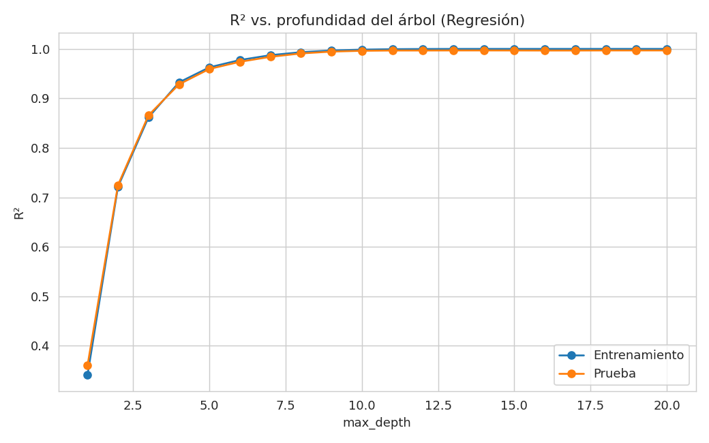
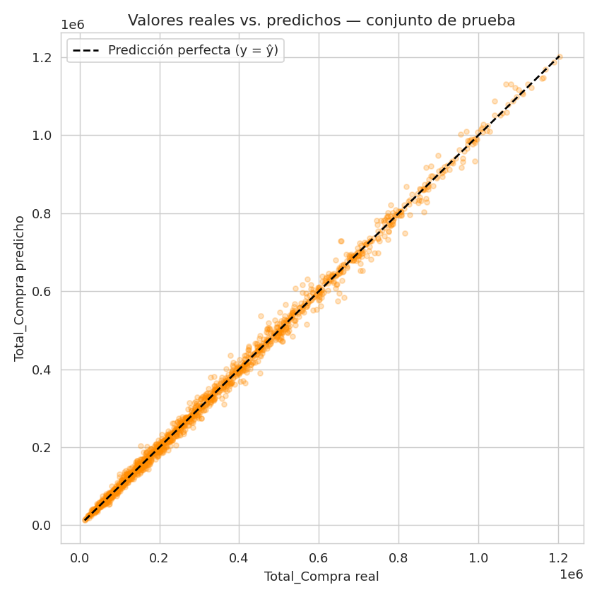

# 🌳 Predicción del Total de Compra en un E-commerce de Repostería con Árbol de Decisión (Regresión)

[](https://www.python.org/)
[](https://scikit-learn.org/stable/modules/tree.html#regression)
[](https://jupyter.org/)
[](#licencia)
[](https://colab.research.google.com/github/jeffer301/INTELIGENCIA-ARTIFICIAL--JEFFERSON-VALENCIA/blob/main/Proyecto%20Final%20Inteligencia%20Artificial/notebook/proyecto_final_ml.ipynb)

Proyecto final de la asignatura **Inteligencia Artificial** — Programa de Ingeniería de Sistemas,
Semestre 8, **Universidad del Pacífico**. Implementa, entrena y evalúa un **Árbol de Decisión de
Regresión** (`DecisionTreeRegressor`, `scikit-learn`) para predecir el **valor total de una
transacción (`Total_Compra`)** en un e-commerce de repostería, siguiendo el flujo completo de un
proyecto de Machine Learning y prestando especial atención a la detección y corrección de
**overfitting** y **underfitting**.

> 📓 El desarrollo completo, con código, gráficas y explicaciones paso a paso, está en
> [`notebook/proyecto_final_ml_regresion.ipynb`](notebook/proyecto_final_ml_regresion.ipynb).

---

## 📑 Tabla de contenido

1. [Descripción del problema](#-descripción-del-problema)
2. [Dataset](#-dataset)
3. [¿Qué es un Árbol de Decisión de Regresión?](#-qué-es-un-árbol-de-decisión-de-regresión)
4. [Estructura del repositorio](#-estructura-del-repositorio)
5. [Cómo ejecutar el proyecto](#-cómo-ejecutar-el-proyecto)
6. [Metodología](#-metodología)
7. [Overfitting vs. Underfitting: el hallazgo central](#-overfitting-vs-underfitting-el-hallazgo-central)
8. [Resultados](#-resultados)
9. [Cuándo usar (y cuándo no) un Árbol de Decisión de Regresión](#-cuándo-usar-y-cuándo-no-un-árbol-de-decisión-de-regresión)
10. [Limitaciones](#-limitaciones)
11. [Conclusiones](#-conclusiones)
12. [Referencias](#-referencias)

---

## 🎯 Descripción del problema

Un e-commerce de repostería necesita **estimar el valor total de una compra** (`Total_Compra`) a
partir de las características de la transacción (precio unitario, cantidad, descuento, tiempo en
el sitio, envío y categoría del producto), útil por ejemplo para proyectar ingresos, dimensionar
inventario o detectar transacciones atípicas antes de confirmar el pago. Es un problema de
**regresión** (la salida es un valor numérico continuo, no una categoría).

**Objetivo general:** implementar y evaluar un Árbol de Decisión de Regresión siguiendo el ciclo
completo de un proyecto de ML — preparación de datos, entrenamiento, validación, evaluación con
métricas apropiadas y análisis crítico de los resultados (incluyendo un diagnóstico explícito de
sobreajuste/subajuste).

## 📊 Dataset

`data/ecommerce_reposteria_10000.csv` — **10.000 transacciones**, 9 columnas, sin valores nulos ni
duplicados.

| Columna | Descripción |
|---|---|
| `ID_Transaccion` | Identificador único (no predictivo) |
| `Categoria_Producto` | Categoría del producto (5 clases) — ahora usada como **variable predictora** (One-Hot Encoding) |
| `Precio_Unitario` | Precio por unidad |
| `Cantidad` | Unidades compradas |
| `Descuento_Aplicado` | % de descuento (0–1) |
| `Tiempo_En_Web_Minutos` | Minutos de navegación antes de comprar |
| `Distancia_Envio_Km` | Distancia de envío |
| `Costo_Envio` | Costo del envío (correlación perfecta con la distancia → se descarta) |
| `Total_Compra` | **Variable objetivo** — valor total de la transacción |

## 🌳 ¿Qué es un Árbol de Decisión de Regresión?

Un `DecisionTreeRegressor` aprende reglas *"si-entonces"* dividiendo los datos en nodos, eligiendo
en cada división la variable y el punto de corte que **más reduce el error cuadrático medio (MSE)**
dentro de los nodos resultantes (a diferencia de un árbol de clasificación, que usa Gini o
entropía), hasta llegar a hojas cuya predicción es el **promedio** de los valores objetivo de los
ejemplos que caen en ellas. Es interpretable, no requiere escalar variables y captura relaciones no
lineales — pero es propenso al overfitting si se deja crecer sin control, y no puede extrapolar
fuera del rango de valores vistos en entrenamiento. Ver el detalle matemático completo, ventajas,
limitaciones y comparación con otros modelos en el
[notebook, sección 3](notebook/proyecto_final_ml_regresion.ipynb).

Documentación oficial: [scikit-learn — Decision Trees (Regression)](https://scikit-learn.org/stable/modules/tree.html#regression)

## 📁 Estructura del repositorio

```
.
├── README.md                                   <- Este archivo
├── notebook/
│   └── proyecto_final_ml_regresion.ipynb       <- Notebook completo (rúbrica de regresión)
├── data/
│   └── ecommerce_reposteria_10000.csv          <- Dataset usado
├── assets/                                     <- Gráficas exportadas para este README
│   ├── eda_scatter_total_compra.png
│   ├── overfitting_curve_regresion.png
│   ├── real_vs_predicho.png
│   └── decision_tree.png
└── requirements.txt                            <- Dependencias de Python
```

## ▶️ Cómo ejecutar el proyecto

```bash
# 1. Clonar el repositorio
git clone https://github.com/jeffer301/INTELIGENCIA-ARTIFICIAL--JEFFERSON-VALENCIA.git
cd "INTELIGENCIA-ARTIFICIAL--JEFFERSON-VALENCIA/Proyecto Final Inteligencia Artificial"

# 2. Crear un entorno virtual (opcional pero recomendado)
python3 -m venv venv
source venv/bin/activate        # En Windows: venv\Scripts\activate

# 3. Instalar dependencias
pip install -r requirements.txt

# 4. Abrir el notebook
jupyter notebook notebook/proyecto_final_ml_regresion.ipynb
```

`requirements.txt`:
```
pandas
numpy
scikit-learn
matplotlib
seaborn
```

## 🔬 Metodología

| Paso | Descripción |
|---|---|
| 1. EDA | Revisión de nulos, duplicados, distribución de `Total_Compra`, dispersión frente a cada variable numérica y matriz de correlación |
| 2. Limpieza | Dataset ya limpio; se documenta el proceso de verificación |
| 3. Selección de variables | Se elimina `ID_Transaccion` (identificador) y `Costo_Envio` (redundante, correlación 1.0 con `Distancia_Envio_Km`); `Categoria_Producto` se codifica con One-Hot Encoding para usarla como predictora |
| 4. Partición | **Entrenamiento 70% / Prueba 15% / Validación 15%** |
| 5. Baseline | `DummyRegressor` (predice siempre el promedio) → R² ≈ 0 — punto de referencia obligatorio |
| 6. Entrenamiento | Árbol de decisión de regresión sin restricciones (caso base) |
| 7. Ajuste de hiperparámetros | `GridSearchCV` + `KFold` (5 folds) sobre `max_depth`, `min_samples_leaf`, optimizando RMSE |
| 8. Selección final | Comparación de 3 árboles (libre / elegido por grid search / simple) → se elige el de mejor equilibrio desempeño-generalización |
| 9. Evaluación | MAE, MSE, RMSE, R², MAPE, gráfico real vs. predicho, análisis de residuos |
| 10. Interpretación | Importancia de variables, visualización del árbol, análisis de overfitting/underfitting |

## ⚖️ Overfitting vs. Underfitting: el hallazgo central

A diferencia de un escenario con señal predictiva débil, aquí `Total_Compra` tiene una relación
**fuerte y casi determinística** con `Precio_Unitario` y `Cantidad`, lo que cambia el diagnóstico
de overfitting respecto a lo esperado:



| Modelo | R² Entrenamiento | R² Prueba | Brecha (train − test) | RMSE Prueba |
|---|---|---|---|---|
| Árbol libre (sin límites) | 1.0000 | 0.9968 | 0.0032 | 14,677 |
| Árbol elegido por `GridSearchCV` (`max_depth=None`, `min_samples_leaf=1`) | 1.0000 | 0.9968 | 0.0032 | 14,677 |
| Árbol simple (`max_depth=4`, `min_samples_leaf=50`) | 0.9323 | 0.9283 | 0.0040 | 69,529 |
| Baseline (predice el promedio) | — | −0.0008 | — | 259,824 |

- El **árbol sin restricciones** llega a memorizar el 100% del entrenamiento (R² = 1.0, 21 niveles
  de profundidad, 6.999 hojas), pero **su R² de prueba sigue siendo altísimo (0.9968)**: aquí no
  hay una brecha grande porque la relación entre las variables predictoras y `Total_Compra` es tan
  fuerte que incluso un árbol muy complejo generaliza bien.
- `GridSearchCV` confirmó esto: el mejor resultado en validación cruzada correspondió justamente al
  árbol **sin restricción de profundidad** — no porque la validación cruzada "fallara", sino porque
  en este caso limitar la profundidad no aporta beneficio de generalización, solo le resta
  precisión.
- El **árbol simple** (`max_depth=4`) sigue siendo útil como referencia de interpretabilidad, pero
  sacrifica bastante desempeño (RMSE casi 5 veces mayor) porque restringe demasiado un modelo que
  podía aprovechar una señal muy fuerte en los datos.
- **Conclusión práctica:** en este dataset, el riesgo real no es tanto el overfitting del árbol
  libre (que generaliza bien), sino el **underfitting** de una restricción de profundidad
  demasiado agresiva.

## 📈 Resultados

**Métricas del modelo final (`DecisionTreeRegressor`, hiperparámetros de `GridSearchCV`) en el
conjunto de prueba:**

| Métrica | Valor |
|---|---|
| MAE (Error absoluto medio) | 9,806 |
| MSE (Error cuadrático medio) | 215,419,410 |
| RMSE (Raíz del error cuadrático medio) | 14,677 |
| R² (Coeficiente de determinación) | 0.9968 |
| MAPE (Error porcentual absoluto medio) | 4.11% |

**Confirmación en el conjunto de validación** (independiente de prueba): MAE = 9,501, RMSE =
14,822, R² = 0.9967 — consistente con el conjunto de prueba, lo que confirma que el modelo
generaliza bien.




**Importancia de variables:**

| Variable | Importancia |
|---|---|
| `Precio_Unitario` | 0.519 |
| `Cantidad` | 0.471 |
| `Descuento_Aplicado` | 0.009 |
| `Distancia_Envio_Km` | 0.001 |
| `Tiempo_En_Web_Minutos` | 0.0003 |
| Categoría del producto (dummies) | ≈ 0.0002 en total |

> `Precio_Unitario` y `Cantidad` concentran prácticamente toda la capacidad predictiva del modelo
> (99% de la importancia combinada), coherente con que el total de una compra depende
> matemáticamente de esas dos variables. Las demás variables (descuento, tiempo en la web, envío,
> categoría) aportan muy poco.

## ✅ Cuándo usar (y cuándo no) un Árbol de Decisión de Regresión

**Úsalo cuando:** necesitas un modelo interpretable y explicable, tus datos tienen relaciones no
lineales entre variables y el objetivo, no quieres invertir tiempo en escalar variables, o buscas
un *baseline* rápido antes de probar modelos de conjunto (Random Forest Regressor, Gradient
Boosting).

**Evítalo (o úsalo con cuidado) cuando:** necesitas **extrapolar** más allá del rango de valores
observados en entrenamiento (el árbol solo predice promedios dentro de rangos ya vistos), el
dataset es pequeño y ruidoso, o necesitas la máxima precisión posible con datos y cómputo
suficientes (un ensamble de árboles casi siempre gana).

## ⚠️ Limitaciones

- Alta varianza e inestabilidad ante pequeños cambios en los datos.
- Predicciones "escalonadas" (constantes dentro de cada hoja), no continuas y suaves como en una
  regresión lineal.
- No puede extrapolar fuera del rango de valores vistos en entrenamiento.
- El dataset es sintético/académico: la relación entre `Precio_Unitario`, `Cantidad` y
  `Total_Compra` es más "limpia" que en un e-commerce real, donde suele haber más ruido,
  promociones especiales o errores de registro.
- Un único árbol suele tener mayor error que un ensamble de árboles (Random Forest, Gradient
  Boosting).

## 🏁 Conclusiones

- El dataset (10.000 filas, limpio) es **suficiente en cantidad** para entrenar un Árbol de
  Decisión de Regresión de forma estable, y sus variables principales (`Precio_Unitario`,
  `Cantidad`) tienen una **relación fuerte** con `Total_Compra`, lo que le permite al modelo lograr
  un desempeño alto (R² ≈ 0.997) tanto en prueba como en validación.
- Se demostró de forma práctica y visual el comportamiento de **underfitting** (árboles muy poco
  profundos, con RMSE alto) y se confirmó que, en este dataset particular, un árbol sin restricción
  de profundidad **no cae en overfitting severo**, gracias a la fuerte señal predictiva disponible
  — un matiz importante frente a la intuición de que "un árbol libre siempre sobreajusta".
- Un buen proceso de modelado (partición correcta, validación cruzada, métricas apropiadas de
  regresión) permitió **confirmar y cuantificar** la relación real entre las variables y el
  objetivo, en vez de asumirla.

## 📚 Referencias

- [scikit-learn — Decision Trees (Regression)](https://scikit-learn.org/stable/modules/tree.html#regression)
- [scikit-learn — `DecisionTreeRegressor`](https://scikit-learn.org/stable/modules/generated/sklearn.tree.DecisionTreeRegressor.html)
- [scikit-learn — `GridSearchCV`](https://scikit-learn.org/stable/modules/generated/sklearn.model_selection.GridSearchCV.html)
- [scikit-learn — Cross-validation](https://scikit-learn.org/stable/modules/cross_validation.html)
- [scikit-learn — Regression metrics](https://scikit-learn.org/stable/modules/model_evaluation.html#regression-metrics)

---

## Licencia

Este proyecto tiene fines académicos (Universidad del Pacífico — Ingeniería de Sistemas).
Puedes reutilizarlo libremente como referencia bajo licencia [MIT](https://opensource.org/licenses/MIT).

## 👥 Integrantes

| Nombre |
|--------|
| Jefferson Manuel Valencia Riascos |
| Isnildo Equia Perteaga |
| Sebastian Rojas Cabrera |
| Yeison Stiven Lozano Angulo |
